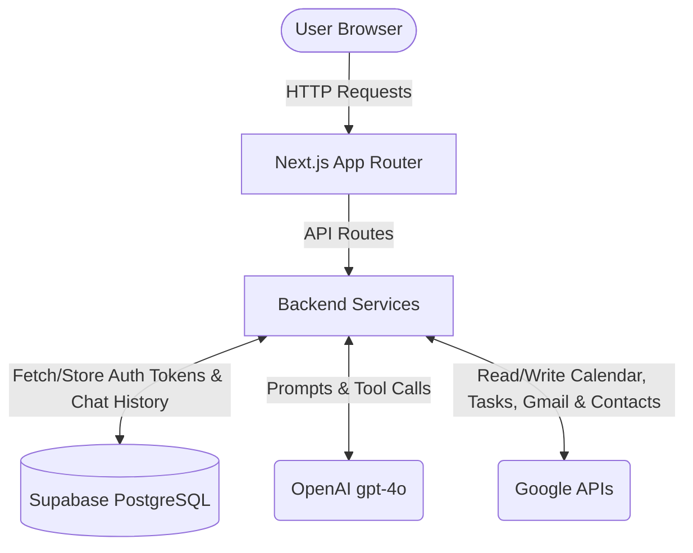

# Architecture & Design

## Overview
This application is a Personal Assistant built with Next.js that integrates with a user's Google Calendar, Google Tasks, Gmail, and Google Contacts via Google OAuth2. It provides a conversational interface powered by OpenAI's Large Language Models (LLMs) equipped with tool-calling capabilities to perform actions on behalf of the user.

## Tech Stack
- **Frontend**: Next.js (React), Tailwind CSS
- **Backend**: Next.js App Router API Routes
- **Database**: Supabase (PostgreSQL)
- **AI/LLM**: OpenAI API (gpt-4o) with Function Calling
- **Authentication**: Custom Google OAuth2 flow with secure HTTP-only cookies

## Architecture Diagram

## Core Components
### 1. Authentication Flow
- **Google OAuth**: Users authenticate with their Google accounts to grant the app access to Calendar, Tasks, Gmail, and Contacts.
- **Session Management**: OAuth tokens (Access and Refresh) are securely stored in the Supabase `users` table. The client only receives a lightweight, encrypted `httpOnly` session cookie containing the `userId`.
- **Token Refresh**: The backend automatically refreshes Google access tokens when they expire, ensuring uninterrupted service.

### 2. Conversational AI & Tool Calling
- **OpenAI Integration**: User queries are sent to OpenAI's API.
- **Tool Definitions**: The system prompt equips the LLM with specific "tools" (functions) such as `list_events`, `create_task`, `delete_event`, `list_emails`, `send_email`, `search_contacts`, etc.
- **Execution Loop**: When the LLM decides to call a tool, the backend intercepts the request, executes the corresponding Google API call using the user's stored OAuth tokens, and returns the result to the LLM to formulate a natural language response.

### 3. Data Persistence
- **Users**: Stores Google Account ID, Email, Access Token, and Refresh Token.
- **Conversations**: Groups messages into threads for context retention.
- **Messages**: Stores both user prompts, assistant responses, and tool call metadata to enable rehydration of the chat history.

## Security Considerations
- **Token Storage**: Sensitive OAuth tokens are strictly kept on the server/database side and never exposed to the client.
- **Service Role Key**: The Supabase Service Role Key is used for backend operations to bypass Row Level Security (RLS) safely within server environments.
- **Cookie Security**: Session cookies are signed and HTTP-only to prevent XSS attacks.

## Agent Guardrails

The assistant enforces multiple layers of guardrails to prevent unintended, harmful, or runaway behaviour.

### 1. Destructive Action Confirmation (Delete Gate)
Deletes are **never executed on the first turn**. The backend explicitly blocks `delete_event` and `delete_task` tool calls unless the current request is a confirmed deletion turn.

- **How it works**: In [executeToolCall.ts](src/lib/openai/executeToolCall.ts), when the tool name is `delete_event` or `delete_task` and `allowDestructiveActions` is `false`, the tool returns a `DELETE_REQUIRES_CONFIRMATION` error instructing the LLM to ask the user first.
- **Confirmation detection**: The [chat.ts](src/lib/openai/chat.ts) `isConfirmedDeleteTurn()` function checks whether (a) the user's message is an affirmative phrase like "yes", "go ahead", or "delete it", AND (b) the last assistant message contained a confirmation question (regex for `delete|remove|cancel|confirm` + `?`).
- **Pending confirmation state**: A `PendingConfirmation` object (containing the item type, ID, and title) is stored in the message metadata and persisted to the database, so confirmation survives page refreshes.

### 2. Tool Loop Limit
The agent caps the tool-calling loop to **5 iterations** (`MAX_TOOL_ITERATIONS = 5`). If the LLM keeps requesting tool calls without producing a final text response, the loop terminates with a `tool_loop_exceeded` error and a user-friendly fallback message. This prevents infinite loops and runaway API costs.

### 3. Scoped Tool Access (Allowlisted Tools)
The LLM can only invoke tools from a **static, explicitly defined list** in [tools.ts](src/lib/openai/tools.ts). The `toolExecutors` map in `executeToolCall.ts` acts as a second gate — any tool name not present in the map returns an `UNKNOWN_TOOL` error. The LLM cannot invent or call arbitrary functions.

### 4. Input Validation & Argument Parsing
- Tool arguments are parsed with `JSON.parse` and validated to be a plain object (not an array, not null). Malformed JSON returns an `INVALID_TOOL_ARGUMENTS` error to the LLM.
- Each Google API wrapper function validates its own required fields (e.g., `event_id`, `title`, `start_datetime`) before making any external call.

### 5. Authentication Boundary
- Every Google API call flows through `getGoogleClient()` in [session.ts](src/lib/auth/session.ts), which verifies the session cookie, looks up the user row, and transparently refreshes expired access tokens.
- If the session is invalid, the user row is missing, or the refresh token has been revoked, the system throws typed errors (`AuthRequiredError`, `AuthExpiredError`) which bubble up to the chat loop and produce a `requiresReauth: true` response — never a raw 500.
- The cookie is cleared on auth failures so stale sessions cannot persist.

### 6. Error Isolation & Graceful Degradation
- **NOT_FOUND ≠ failure**: `EventNotFoundError` and `TaskNotFoundError` are treated as empty search results, not system errors. The assistant tells the user plainly that no match was found and asks for more detail, rather than saying "I encountered a problem".
- **Google API errors**: Wrapped in a `GoogleApiError` class and returned to the LLM as structured tool results so the model can communicate the issue to the user.
- **OpenAI failures**: Timeout, auth, and generic OpenAI errors each have dedicated error classes and user-facing fallback messages. The assistant never leaks raw error details.
- **Database failures**: `DatabaseConfigurationError` and `DatabaseUnavailableError` produce a clear "assistant temporarily unavailable" message.

### 7. Conversation History Windowing
Only the last **20 messages** (`MAX_HISTORY_MESSAGES = 20`) are sent to the LLM. This bounds token usage and prevents context-window overflow attacks where a malicious or very long conversation could cause the model to behave unpredictably.

### 8. System Prompt Constraints
The [system prompt](src/lib/openai/systemPrompt.ts) encodes behavioural rules that the LLM must follow:
- Ask clarifying questions when required information is missing (title, time, date range).
- Never guess an event/task ID — always use `find_event` / `find_task` first.
- For rescheduling, preserve the original event duration unless the user explicitly changes it.
- After a tool executes, summarize the concrete result; avoid generic replies like "Done!".

## Deployment Strategy
- **Platform**: Vercel is recommended for deploying the Next.js application.
- **Database**: Supabase cloud instance.
- **Environment Variables**: Necessary API keys and secrets must be configured in the deployment platform's environment settings.
