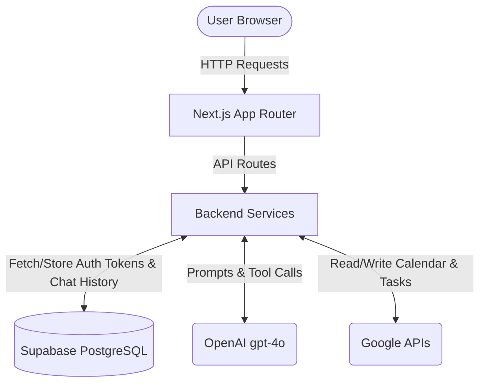

# Architecture & Design

## Overview
This application is a Personal Assistant built with Next.js that integrates with a user's Google Calendar and Google Tasks via Google OAuth2. It provides a conversational interface powered by OpenAI's Large Language Models (LLMs) equipped with tool-calling capabilities to perform actions on behalf of the user.

## Tech Stack
- **Frontend**: Next.js (React), Tailwind CSS
- **Backend**: Next.js App Router API Routes
- **Database**: Supabase (PostgreSQL)
- **AI/LLM**: OpenAI API (gpt-4o) with Function Calling
- **Authentication**: Custom Google OAuth2 flow with secure HTTP-only cookies

## Architecture Diagram

## Core Components
### 1. Authentication Flow
- **Google OAuth**: Users authenticate with their Google accounts to grant the app access to Calendar and Tasks.
- **Session Management**: OAuth tokens (Access and Refresh) are securely stored in the Supabase `users` table. The client only receives a lightweight, encrypted `httpOnly` session cookie containing the `userId`.
- **Token Refresh**: The backend automatically refreshes Google access tokens when they expire, ensuring uninterrupted service.

### 2. Conversational AI & Tool Calling
- **OpenAI Integration**: User queries are sent to OpenAI's API.
- **Tool Definitions**: The system prompt equips the LLM with specific "tools" (functions) such as `get_calendar_events`, `create_task`, `delete_event`, etc.
- **Execution Loop**: When the LLM decides to call a tool, the backend intercepts the request, executes the corresponding Google API call using the user's stored OAuth tokens, and returns the result to the LLM to formulate a natural language response.

### 3. Data Persistence
- **Users**: Stores Google Account ID, Email, Access Token, and Refresh Token.
- **Conversations**: Groups messages into threads for context retention.
- **Messages**: Stores both user prompts, assistant responses, and tool call metadata to enable rehydration of the chat history.

## Security Considerations
- **Token Storage**: Sensitive OAuth tokens are strictly kept on the server/database side and never exposed to the client.
- **Service Role Key**: The Supabase Service Role Key is used for backend operations to bypass Row Level Security (RLS) safely within server environments.
- **Cookie Security**: Session cookies are signed and HTTP-only to prevent XSS attacks.

## Deployment Strategy
- **Platform**: Vercel is recommended for deploying the Next.js application.
- **Database**: Supabase cloud instance.
- **Environment Variables**: Necessary API keys and secrets must be configured in the deployment platform's environment settings.
