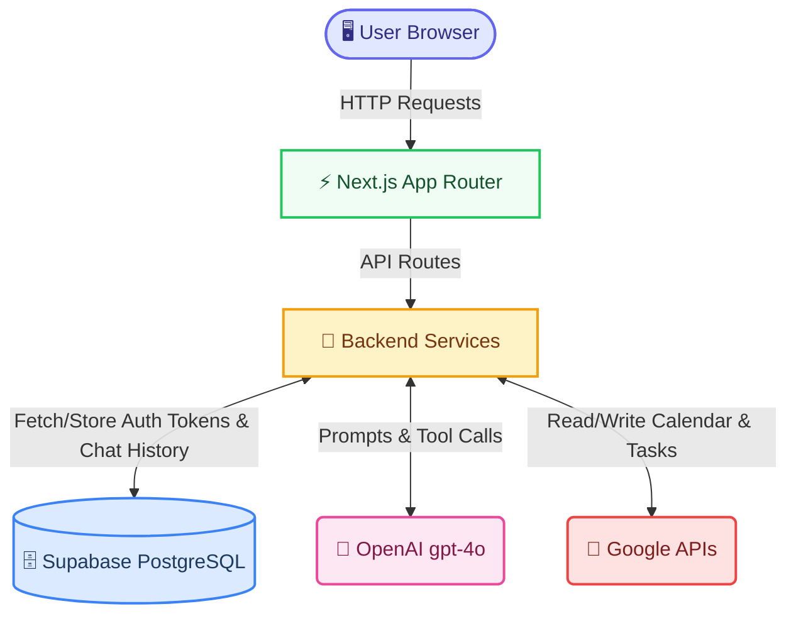

# 🤖 Personal Assistant — AI-Powered Google Workspace Manager

> A conversational AI assistant that manages your **Google Calendar** and **Google Tasks** through natural language, powered by OpenAI function calling.

[](https://personal-assistant-hxty.onrender.com)
[](https://github.com/RagavRida/personal-assistant)

---

## ✨ Features

- **Natural Language Interface** — Chat with your calendar and tasks using everyday language
- **Google Calendar Integration** — Create, update, delete, list, and reschedule events
- **Google Tasks Integration** — Create, update, complete, delete, and list tasks
- **Smart Tool Calling** — OpenAI function calling routes your intent to the correct Google API
- **Conversation History** — Full chat persistence with Supabase Postgres
- **Secure OAuth2** — Server-side token storage with signed HTTP-only session cookies
- **Voice Input** — Speak your requests with built-in microphone support
- **Guardrailed Agent** — Destructive actions require explicit user confirmation

---

## 🏗️ Architecture



> For a deep dive into guardrails, security, and system design, see the [Architecture & Design Document](ARCHITECTURE.md).

---

## 🛠️ Tech Stack

| Layer | Technology |
|---|---|
| **Frontend** | Next.js 16 (React 19), Tailwind CSS 4 |
| **Backend** | Next.js App Router API Routes (Node.js) |
| **AI/LLM** | OpenAI API (gpt-4o) with Function Calling |
| **Database** | Supabase (PostgreSQL) |
| **Auth** | Google OAuth2, signed HTTP-only cookies (jose) |
| **Hosting** | Render (Web Service) |

---

## 🚀 Getting Started

### Prerequisites

- Node.js 18+
- A [Google Cloud](https://console.cloud.google.com) project with Calendar & Tasks APIs enabled
- A [Supabase](https://supabase.com) project
- An [OpenAI](https://platform.openai.com) API key

### 1. Clone & Install

```bash
git clone https://github.com/RagavRida/personal-assistant.git
cd personal-assistant
npm install
```

### 2. Configure Environment

Copy `.env.example` to `.env.local` and fill in your credentials:

```bash
cp .env.example .env.local
```

| Variable | Description |
|---|---|
| `GOOGLE_CLIENT_ID` | OAuth 2.0 Client ID from Google Cloud Console |
| `GOOGLE_CLIENT_SECRET` | OAuth 2.0 Client Secret |
| `GOOGLE_REDIRECT_URI` | `http://localhost:3000/api/auth/google/callback` (local) |
| `SESSION_COOKIE_SECRET` | Random string, at least 32 characters |
| `SUPABASE_URL` | Your Supabase project URL |
| `SUPABASE_SERVICE_ROLE_KEY` | Supabase `service_role` key (server-side only) |
| `OPENAI_API_KEY` | Your OpenAI API key |
| `OPENAI_MODEL` | Model to use (default: `gpt-4o`) |

### 3. Set Up Supabase

1. Create a Supabase project at [supabase.com](https://supabase.com).
2. Go to **Project Settings → API** and copy the Project URL and `service_role` key.
3. Open **SQL Editor** and run the migration:

   ```text
   supabase/migrations/001_initial_schema.sql
   ```

   This creates the following tables:

   | Table | Purpose |
   |---|---|
   | `users` | Google account email and OAuth tokens |
   | `conversations` | Active conversation threads per user |
   | `messages` | Persisted user/assistant messages and tool-call metadata |

### 4. Set Up Google Cloud

1. Create a project at [console.cloud.google.com](https://console.cloud.google.com).
2. Enable **Google Calendar API** and **Google Tasks API**.
3. Configure **OAuth consent screen** → External → add your Google account as a test user.
4. Create **OAuth 2.0 Client ID** (Web application) with redirect URI:
   ```
   http://localhost:3000/api/auth/google/callback
   ```
5. Copy Client ID and Secret into `.env.local`.

### 5. Run Locally

```bash
npm run dev
```

Visit [http://localhost:3000](http://localhost:3000) and click **Connect Google Account** to get started.

---

## 🧪 Testing

### Quick Smoke Test

1. Visit `http://localhost:3000/api/auth/google` and complete the OAuth flow.
2. Confirm the status bar shows your Google account as **Connected**.
3. Send: `What does my calendar look like this week?`
4. Refresh the page and confirm the conversation rehydrates from history.

### Full Test Script

| # | Prompt | Expected Behavior |
|---|---|---|
| 1 | `Schedule a meeting with John tomorrow at 3 PM` | Creates a calendar event |
| 2 | `Move my Friday meeting to Monday morning` | Reschedules (preserves duration) |
| 3 | `What does my calendar look like this week?` | Lists events for the week |
| 4 | `Create a task to submit the monthly report next Monday` | Creates a task with due date |
| 5 | `Mark my grocery task as completed` | Updates task status |
| 6 | `Delete my dentist appointment` | **Asks for confirmation first** |
| 7 | `Show me all tasks due this week` | Lists filtered tasks |
| 8 | 🎤 Voice: `Create a task to review demo notes tomorrow` | Transcribes and creates task |
| 9 | `Schedule lunch with John` (ambiguous) | Asks a clarifying question |

---

## 🛡️ Agent Guardrails

| Guardrail | Description |
|---|---|
| **Delete Confirmation** | Destructive actions are blocked until the user explicitly confirms |
| **Tool Loop Limit** | Max 5 tool-calling iterations to prevent runaway loops |
| **Allowlisted Tools** | LLM can only call statically defined tools; unknown tools are rejected |
| **Input Validation** | Tool arguments are parsed and type-checked before API calls |
| **Auth Boundary** | Typed auth errors; auto token refresh; cookie cleared on failure |
| **Error Isolation** | NOT_FOUND = search miss, not a crash; no raw errors leak to the user |
| **History Windowing** | Only last 20 messages sent to LLM to bound token usage |

---

## ⚠️ Error Handling

- **Database unavailable** → `/api/chat` returns `"assistant temporarily unavailable"` instead of a raw 500.
- **Stale session** → Cookie is cleared and user is prompted to reconnect Google.
- **Token refresh failure** → Response includes `requiresReauth: true` so the UI shows a reconnect button.

---

## 🌐 Deployment (Render)

The app is deployed as a **Web Service** on [Render](https://render.com).

**Live URL**: [https://personal-assistant-hxty.onrender.com](https://personal-assistant-hxty.onrender.com)

### Deploy your own

1. Go to [Render Dashboard](https://dashboard.render.com) → **New** → **Web Service**.
2. Connect your GitHub repo.
3. Configure:

   | Setting | Value |
   |---|---|
   | **Runtime** | Node |
   | **Build Command** | `npm install && npm run build && cp -r .next/static .next/standalone/.next/static && cp -r public .next/standalone/public 2>/dev/null \|\| true` |
   | **Start Command** | `node .next/standalone/server.js` |

4. Add all environment variables from `.env.local`.
5. Set `GOOGLE_REDIRECT_URI` to `https://<your-render-domain>.onrender.com/api/auth/google/callback`.
6. Update your **Google Cloud Console** OAuth credentials to include the production redirect URI.
7. Click **Deploy**.

---

## 📄 License

This project is for educational and assignment purposes.
